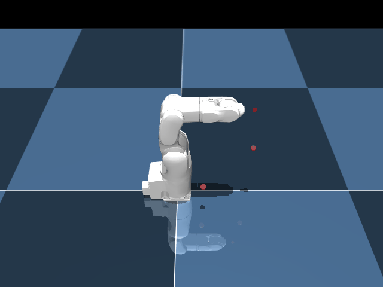
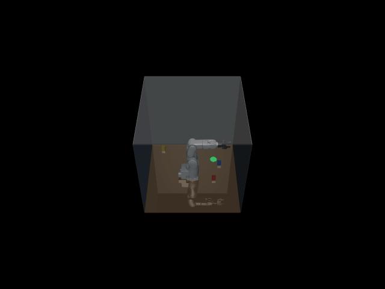

# VS050 Environments

This module contains the reinforcement learning environments built using Gymnasium for the DENSO VS050 robot arm.

## `VS050-ReachPose-v0`



ReachPose is a goal-oriented environment designed for Hindsight Experience Replay (HER). The 6-DoF VS050 arm must move its end-effector to a randomly sampled 3D target position inside its reachable workspace.

* **Simulation:** The bare VS050 arm on a floor. A translucent red sphere marks the goal position, sampled from a conservative workspace envelope.
* **Objective:** Drive the end-effector (the `attachment_site`) within `4 cm` of the desired target.
* **HER-Compatible:** Implements the GoalEnv dict observation spec so that HER can relabel achieved/desired goals after the fact.

### Action Space

The action space is a `Box(-1.0, 1.0, (6,), float32)`.

| Index | Name | Control Type | Max delta per step |
|-------|------|--------------|--------------------|
| `0–5` | Base & Arm Joints | Delta Position Target | `[0.08, 0.08, 0.08, 0.10, 0.10, 0.15]` rad |

### Observation Space

The observation space is a Dict with GoalEnv-compatible keys:

| Key              | Shape       | Description |
|------------------|-------------|-------------|
| `observation`    | `(27,)`     | Joint pos (6) + joint vel (6) + EE xyz (3) + control targets (6) + target geom xyz (3) + target site xyz (3) + padding (3) |
| `achieved_goal`  | `(3,)`      | End-effector position in world frame |
| `desired_goal`   | `(3,)`      | Target position in world frame |

### Reward

A mix of dense shaping and a sparse success bonus:

```math
R = \begin{cases}
-\| \text{achieved} - \text{desired} \|_2, & \text{if } d > 4 \text{ cm}\\
10.0, & \text{if } d < 4 \text{ cm}
\end{cases}
```

### Termination / Truncation

- **Termination:** Exact when the end-effector is within `4 cm` of the desired goal.
- **Truncation:** Standard maximum episode limit of `500` timesteps.

---

## `VS050-PickAndPlace-v0`



A dense-reward environment where the agent must control the VS050 robot arm and a Robotiq 2F-85 gripper to pick up cubic objects and place them on a target marker.

* **Simulation:** The robot operates inside a transparent 1.2m³ glass cage with a wood floor. Three colored cubes (red, blue, yellow) spawn at random intervals within the cage area.
* **Objective:** Move the gripper, securely grab an object, and bring it within `5 cm` of the green target site.

### Action Space

The action space is a `Box(-1.0, 1.0, (7,), float32)`.

| Index | Name | Control Type | Action Range |
|-------|------|--------------|--------------|
| `0–5` | Base & Arm Joints | Delta Position Target | `[-0.05 rad, 0.05 rad]` |
| `6`   | Gripper Opening | Absolute Position | `[-1.0 (open), 1.0 (closed)]` |

### Observation Space

The observation space is a `Box(-inf, inf, (37,), float32)`.

| Indices | Description | Details |
|---------|-------------|---------|
| `0–5` | Joint positions (`qpos`) | The rotational position of the 6 robot joints (rad). |
| `6–11`| Joint velocities (`qvel`) | The rotational velocity of the 6 robot joints (rad/s). |
| `12`  | Gripper state | The normalized `[0, 1]` state of the gripper actuator. |
| `13–21`| Object positions (x3) | XYZ Cartesian coordinates for each of the 3 spawnable objects. |
| `22–33`| Object orientations (x3)| XYZW Quaternions for each of the 3 objects. |
| `34–36`| Target position | XYZ Cartesian coordinates of the target drop zone. |

### Reward

The reward heavily penalizes distance while reinforcing successful manipulation heuristics:

```math
R = -D_{\text{reach}} + B_{\text{grasp}} - D_{\text{place}} + B_{\text{success}}
```

- **Reach Penalty ($D_{\text{reach}}$):** Negative Euclidean distance from the gripper pinch point to the nearest object.
- **Grasp Bonus ($B_{\text{grasp}}$):** Exact `+0.5` points granted continuously when the object is lifted `>1 cm` from the floor while gripped.
- **Place Penalty ($D_{\text{place}}$):** Negative Euclidean distance between the currently grasped object and the final destination.
- **Success Bonus ($B_{\text{success}}$):** A flat `+10.0` points is given if the object arrives inside the target area.

### Termination / Truncation

- **Termination:** Triggers exactly when any object reaches `< 5 cm` from the `target_site`.
- **Truncation:** Standard maximum episode limits bound at `500` timesteps.

---

**Running an Example Headless/Human Agent:**
```bash
uv run python examples/random_agent.py
```
