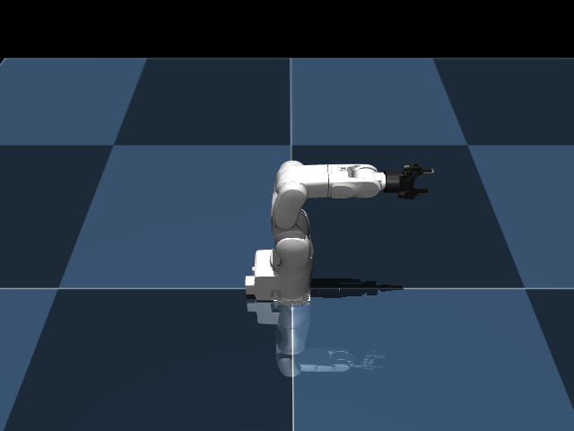

# VS050 MuJoCo Models

This directory contains standalone MuJoCo XML models and graphical assets for the DENSO VS050 robot arm and the Robotiq 2F-85 gripper.



## Models Available

- `vs050.xml`: The base 6-DoF DENSO arm mounted on a floor.
- `vs050_2f85.xml`: The arm with the [Robotiq 2F-85 gripper](https://github.com/google-deepmind/mujoco_menagerie/tree/main/robotiq_2f85) attached to its wrist.
- `pick_and_place_scene.xml`: The compound simulation scene used for the RL environment containing a transparent cage and pickable objects.
- `scene_reach.xml`: The minimal scene for the reach-pose task — the VS050 arm with a translucent sphere marker used as the goal target.

## Robot Specifications

| Parameter | Value |
|-----------|-------|
| Degrees of freedom | 6 revolute |
| Total reach | ~800 mm |
| Payload | 5 kg |
| Mounting | Floor (fixed base) |

### Kinematic Chain

```text
world → base_link
  joint_1 (Z) → J1   @ z +181.5 mm
    joint_2 (Y) → J2   @ z +163.5 mm
      joint_3 (Y) → J3   @ z +250.0 mm
        joint_4 (Z) → J4   @ x -10 mm, z +119.5 mm
          joint_5 (Y) → J5   @ z +135.5 mm
            joint_6 (Z) → J6   @ z  +70.0 mm
              attachment_site    @ z  +50.0 mm
```

### Joint Limits

| Joint | Lower (rad) | Upper (rad) | Max vel (rad/s) |
|-------|------------|------------|----------------|
| joint_1 | -2.967 | 2.967 | 3.731 |
| joint_2 | -2.094 | 2.094 | 2.487 |
| joint_3 | -2.182 | 2.705 | 2.715 |
| joint_4 | -4.712 | 4.712 | 3.731 |
| joint_5 | -2.094 | 2.094 | 2.871 |
| joint_6 | -6.283 | 6.283 | 5.969 |

## Usage & Control

The default actuators in `vs050.xml` are **position-controlled** (`<position>`). To switch to torque control, replace the `<actuator>` block with `<motor>` elements.

### Using the Robotiq 2F-85 Gripper

The gripper's multi-bar linkage is fully simulated using equality constraints and a single general actuator (`fingers_actuator`) with a control range of `[0, 255]`. Both the arm's joints and the gripper can be controlled programmatically via `data.ctrl`.

## Keyframes

| Name | Description |
|------|-------------|
| `home` | All joints zero except `joint_3` = π/2 (≈ 90°), matching standard rest poses. |

## Meshes & Assets

Collada (`.dae`) and STL meshes are located in the `assets/` directory. They are natively supported by MuJoCo (≥ 2.3.x).

## Visualizer

Run the interactive viewer:

```bash
uv run python -m vs050_mujoco.models.visualize [reach|pick|vs050|2f85]
```

| Arg | Model |
|-----|-------|
| `reach` | scene_reach.xml (default) |
| `pick` | pick_and_place_scene.xml |
| `vs050` | vs050.xml |
| `2f85` | vs050_2f85.xml |

Controls: [drag] rotate, [scroll] zoom, [shift+drag] pan. Press [ESC] to exit.
